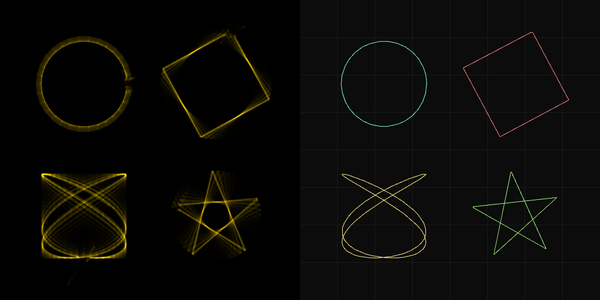

# ofxTwoscilloscope
<br>
Vector shapes to oscilloscope audio and back again in openFrameworks, tested with oF 0.12.1.<br>

Two oscilloscope projects, joined at the audio:

* **[XYscope](https://teddavis.org/xyscope)** by Ted Davis, a Processing library that
  turns vector drawings into audio for analog vector displays, became `XYscope`.
* **[Oscilloscope](https://github.com/kritzikratzi/Oscilloscope)** by Hansi Raber, an
  openFrameworks app that renders XY audio the way an analog scope does, became
  `Oscilloscope`, plus `XYDecoder` to recover the vector shapes from the audio.

With both halves in one place there's a third thing to do: `XYTransformer` turns a
vector shape into a new vector shape by encoding it as audio, running the audio through
effects, and decoding it again.

```cpp
#include "ofxTwoscilloscope.h"
```

## XYscope format audio

A drawing becomes one loop of stereo audio, repeated `freq()` times a second (50 by
default): X on the left channel, Y on the right, each from -1 to 1 with +Y up. A third
channel, Z, blanks the beam (-1) while it travels between shapes (+1 is on). A canvas
point maps to audio as

    x = 2 * px / width - 1        y = 1 - 2 * py / height

Feed the left and right channels of a DC-coupled sound card into an oscilloscope in X-Y
mode, a modded Vectrex or a laser and the drawing appears.

## 1. Vectors to audio: `XYscope`

```cpp
XYscope xy;

void ofApp::setup() {
    xy.setup();          // canvas = window, 44.1kHz, 512 sample waves
    xy.openAudioOut();   // the default sound card
}

void ofApp::draw() {
    xy.clearWaves();
    xy.circle(ofGetWidth() / 2, ofGetHeight() / 2, 300);
    xy.textSize(48);
    xy.text("hello", 40, 40);
    xy.buildWaves();

    xy.drawXY();         // a preview of what the scope will show
}
```

The drawing API follows XYscope and Processing: `point`, `line`, `rect`, `square`,
`ellipse`, `circle`, `lissajous`, `beginShape`/`vertex`/`endShape`, 3D `box`, `sphere`,
`ellipsoid` and `torus`, a transform stack (`pushMatrix`, `translate`, `rotate`,
`rotateX`...), and text in 32 single stroke Hershey fonts. `polyline()` and `path()` take
openFrameworks shapes. `freq()`, `amp()`, `steps()`, `waveSize()`, `limitPoints()`,
`limitPath()`, `zRange()` and `vectrex()` work as they do in XYscope.

Other ways to get the audio out:

```cpp
xy.audioOut(buffer);                 // from your own ofApp::audioOut()
xy.audioOutAdd(buffer);              // mix several XYscopes, for additive synthesis
ofSoundBuffer audio = xy.render(4);  // 4 seconds, offline
xy.recorderBegin(); ... xy.recorderEnd();   // record to bin/data/XYscope_<date>.wav
xy.process(ofGetLastFrameTime());    // no sound card: run on the clock
```

`openAudioOut(-1, 3)` sends Z on a third channel, and `render(seconds, 3)` writes it to a
3-channel file, which `Oscilloscope` reads as brightness.

## 2. Audio to vectors: `Oscilloscope` and `XYDecoder`

```cpp
Oscilloscope scope;
XYPlayer player;

void ofApp::setup() {
    scope.setup(512, 512);
    player.load("xyscope.wav");
    player.setScope(&scope);
    player.play();
    // ...and an ofSoundStream with this app as its output listener
}

void ofApp::audioOut(ofSoundBuffer & buffer) {
    player.audioOut(buffer); // to the sound card, and to the scope
}

void ofApp::update() {
    scope.update();
    shapes = scope.getShapes(512, 512); // std::vector<ofPolyline>
}

void ofApp::draw() {
    scope.draw();
}
```

`Oscilloscope` takes audio from any thread (`addBuffer()`, or make it the input listener
of an `ofSoundStream`), upsamples it to 192kHz and draws it with the original app's
gaussian beam shader into a fading FBO, for the glow and afterglow of a CRT. 1, 2, 3 and
4 channel audio draw as Y-T, X-Y, X-Y with brightness, and a red/cyan pair, as they did in
the app. The settings are plain members: `strokeWeight`, `intensity`, `afterglow`, `hue`,
`scale`, `invertX`, `invertY`, `flipXY`, `zModulation`.

`getShapes()` hands the most recent audio to `XYDecoder`, which finds the loop (from
`decoderSettings.freq` if you know it, otherwise with the YIN pitch detector), maps one loop of
samples back to the canvas, and breaks it into strokes where Z blanks the beam or the beam
jumps. Use `XYDecoder` directly on any buffer:

```cpp
ofSoundBuffer audio;
WavFile::load("drawing.wav", audio);
XYDecoderSettings settings;
settings.width = settings.height = 512;
auto shapes = XYDecoder::decode(audio, settings);
XYDecoder::saveSvg("drawing.svg", shapes, 512, 512);
```

## 3. Vectors to audio to vectors: `XYTransformer`

```cpp
XYTransformer transformer;

void ofApp::setup() {
    transformer.setup(512, 512);   // canvas, 44.1kHz, 50Hz loop
    transformer.effects.add<XYLowPass>()->cutoff = 1200;
    transformer.effects.add<XYChannelDelay>()->delayY = 0.5f;
}

void ofApp::update() {
    altered = transformer.transform(shapes);
}
```

The shapes are encoded exactly as `XYscope` would play them, the audio runs through the
effect chain for a few loops so filters and echoes settle, and the last loop is decoded
back onto the same canvas. `getProcessedCycle()` is that loop of altered audio, ready for
`XYscope::setWaveforms()`, so you can hear (or scope) exactly the shape you see.

| Effect | What it does to a shape |
| --- | --- |
| `XYLowPass` | rounds corners and swallows small detail |
| `XYHighPass` | AC coupling: shapes sag and smear, like a cheap sound card |
| `XYChannelDelay` | delays X or Y, shearing the shape and opening lines into loops |
| `XYEcho` | ghost copies from earlier in the loop |
| `XYBitCrush` | snaps the beam to a coarse grid |
| `XYSampleHold` | lowers the sample rate: steps, corners and stray dots |
| `XYDrive` | tanh saturation pushes shapes out towards a rounded square |
| `XYWavefold` | folds the signal back at the edges, a kaleidoscope |
| `XYRingMod` | multiplies by a sine: shapes pulse in and out of the center |
| `XYNoise` | jitter, seeded so the same settings give the same shape |
| `XYRotate` | mixes X and Y with a rotation matrix, optionally spinning |

Every setting is an `ofParameter`, so `gui.setup(transformer.effects.parameters)` gives
you a panel. Subclass `XYEffect` and override `processFrame()` for your own.

## Examples

* **example-encode**: shapes, Hershey text, a 3D torus or a mouse drawing, played out of
  the sound card as XYscope audio, with the wavetables and output alongside.
  `r` records, `e` exports 10 seconds offline as a 3-channel WAV.
* **example-decode**: plays `bin/data/xyscope.wav` (or any WAV you drop on the window,
  or the line input with `i`) through the beam renderer, and decodes it into vector
  shapes beside it. `s` saves them as SVG.
* **example-transform**: a shape, the same shape as audio through the effects (as a
  beam), and the shape decoded from that audio. Pick sources with `1`-`4` (or draw in
  the first panel), solo effects with `e`, tweak them in the panel, and press `a` to feed
  the result back in for another generation. `s` saves SVG, `w` saves WAV.

Build them with `make` (Linux) or generate project files with the project generator.
The examples ask for OpenGL 3.1 on ARM Linux (the Raspberry Pi's limit) and 3.2
elsewhere.

openFrameworks' makefiles don't rebuild addon objects when only a header changes, so
after updating the addon, delete `addons/obj/<platform>/Release/ofxTwoscilloscope` (or
`make clean`) before building, or the old objects can crash your app.

## Data

The Hershey fonts are in `data/hershey_fonts` and get copied to `bin/data` by the
makefiles and the project generator. `futural` is also compiled in, so text works without
them.

## Differences from the originals

Each ported class lists its changes at the top of its header. The big ones:

* Minim is replaced by `ofSoundStream`, and Z goes out as a third channel on the same
  device rather than on a second sound card. Laser RGB output isn't ported.
* Processing's `screenX()`/`screenY()` are replaced by XYscope's own transform stack,
  with the projection of Processing's default P3D camera.
* Hershey glyphs use their left and right bearings, so text spacing differs a little
  from XYscope.
* FFmpeg (ofxAvCodec) is replaced by a built-in WAV reader and a windowed sinc
  resampler, so the decoder reads WAV only.
* The Oscilloscope app's UI, playlist, video export and laser output stay in the app.

## License

LGPL v3, since `XYscope`, `XYWavetable` and `HersheyFont` are ports of XYscope (LGPL v3).
The code ported from Oscilloscope is also under its MIT license, and the Hershey font
data carries its own acknowledgements. See [LICENSE.txt](LICENSE.txt).
